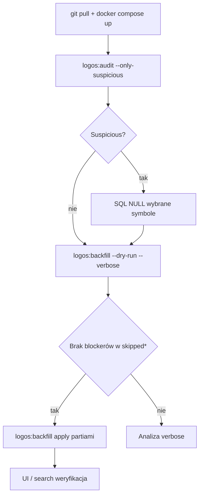

# Brief: logo firm, wyszukiwarka spółek i pipeline danych

**Stan:** wdrożone na `origin/main` (ostatnia linia logo/audyt: commit `95bbcf62` i wcześniejsze fixy backfill/search).  
**Cel dokumentu:** jeden kompletny opis tego, co już mamy — bez sekretów (tylko nazwy usług, hostów, zmiennych środowiskowych).

---

## 1. Cel produktowy

- W UI (`CompanyLogo`) pokazywać **prawdziwe logo z bazy** (`companies.logoUrl`), a przy braku URL — monogram tickera.
- Unikać **błędnych logo** między różnymi emitentami o tym samym symbolu bazowym (BDX, MRK, ING, PEP/KO itd.).
- Uzupełniać `logoUrl` **systemowo** (CLI), nie ręcznymi mapami w frontendzie.
- **Audytować** już zapisane, podejrzane URL-e (read-only), potem ewentualnie ręczne SQL + ponowny backfill.

---

## 2. Infrastruktura i serwery (nazwy, bez wartości)

### Repozytorium i deploy

| Element | Nazwa |
|--------|--------|
| Git hosting | **GitHub** — repo `ApexPayGG/aplikacja-gielda` |
| CI/CD | **GitHub Actions** (workflow deploy na VPS) |
| Produkcja app | **VPS** (docelowo **Hetzner**, Ubuntu) |
| Orkiestracja prod | **Docker Compose** — plik `docker-compose.prod.yml` |
| Domena prod | **stock-ai.pro** (nginx + TLS) |
| DNS / CDN | **Cloudflare** (DNS, proxy do origin na VPS) |
| TLS | **Let's Encrypt** (certbot, volumy w kontenerze nginx) |

### Kontenery / usługi w `docker-compose.prod.yml`

| Serwis Docker | Obraz / rola |
|---------------|----------------|
| `timescaledb` | **TimescaleDB** (PostgreSQL 15) — baza `stockai`, dane aplikacji (Prisma) |
| `redis` | **Redis 7** — kolejki (**BullMQ**), cache API |
| `api` | **stockai-api** — Node.js API (`apps/api`, port 3000) |
| `frontend` | **stockai-frontend** — statyczny build React/Vite (nginx wewnątrz) |
| `nginx` | **nginx** — reverse proxy :80/:443, `/api` → backend, frontend + TLS |

### Aplikacje w monorepo

| Ścieżka | Rola |
|---------|------|
| `apps/api` | Backend Express, Prisma, scrapers, joby, CLI (`logos:backfill`, `logos:audit`) |
| `apps/frontend` | SPA (Vite), konsumuje REST API |
| `infra/` | Dodatkowa konfiguracja infra (docker-compose dev) |

### Zmienne środowiskowe (nazwy — bez wartości)

Pliki szablonów: `apps/api/.env.example`, `.env.production.example`, `infra/.env.example`.

| Grupa | Zmienne (nazwy) |
|-------|------------------|
| Serwer API | `PORT`, `NODE_ENV` |
| Baza | `DATABASE_URL` |
| Redis | `REDIS_URL`, opcjonalnie `REDIS_STATS_SECRET` |
| Logo / rynek (backfill) | `EODHD_API_KEY`, `FINNHUB_API_KEY` |
| Rynek ogólnie | `POLYGON_API_KEY`, `ALPHA_VANTAGE_KEY`, `ALPACA_API_KEY`, `ALPACA_API_SECRET`, `ALPACA_MODE` |
| Fundamenty / dywidendy | `EODHD_FUNDAMENTALS_API_BASE`, `EODHD_FUNDAMENTALS_EXCHANGE`, `EODHD_DIVIDEND_FROM_YEAR`, `DIVIDEND_*`, `FUNDAMENTAL_*` |
| AI | `ANTHROPIC_API_KEY`, `ANTHROPIC_SIGNAL_BRIEF_MODEL` |
| Płatności | `STRIPE_SECRET_KEY`, `STRIPE_WEBHOOK_SECRET`, `STRIPE_*_PRICE_ID` |
| Frontend URL | `FRONTEND_BASE_URL` |
| Auth | `JWT_SECRET` |
| Powiadomienia | `TELEGRAM_BOT_TOKEN`, `RESEND_API_KEY` |
| Geo affiliate | `IPAPI_BASE_URL` (host **ipapi.co**) |
| Market events | `MARKET_EVENTS_ENABLED`, `FMP_API_KEY` (opcjonalny przyszły provider) |

---

## 3. Zewnętrzne API i hosty (używane w projekcie)

### Bezpośrednio w pipeline logo

| Provider | Host / endpoint (publiczna nazwa) | Użycie logo |
|----------|-----------------------------------|-------------|
| **EODHD** | `eodhd.com` — `/api/fundamentals`, statyczne `eodhd.com/img/logos/{EXCHANGE}/...` | `General.LogoURL` w backfill; segment `{EXCHANGE}` w audycie i walidacji donora |
| **Finnhub** | `finnhub.io/api/v1` (profile), `static2.finnhub.io` (obrazy logo) | `fetchCompanyProfile()` — logo + nazwa; URL bez ścieżki giełdy = neutralny w audycie |

### Inne API rynkowe (aplikacja szersza — nie tylko logo)

| Provider | Host (nazwa) | Typowe użycie w StockAI |
|----------|--------------|-------------------------|
| **EODHD** | `api.eodhistoricaldata.com`, `eodhd.com/api` | Notowania EOD, dywidendy, fundamenty, wyszukiwanie spółek |
| **Finnhub** | `finnhub.io` | Quote, news, dywidendy, profil spółki |
| **Polygon.io** | Polygon REST API | Joby notowań (`POLYGON_API_KEY`) |
| **Alpha Vantage** | `alphavantage.co` | Quote / RSI (orchestrator, fallback) |
| **Alpaca** | Alpaca Markets API | Paper trading (tryb paper/live przez `ALPACA_MODE`) |
| **FMP** | Financial Modeling Prep (planowany / opcjonalny) | Komentarz w env pod earnings calendar |

### AI, płatności, powiadomienia

| Provider | SDK / usługa |
|----------|----------------|
| **Anthropic** | Claude (`@anthropic-ai/sdk`) — briefy, crowd wisdom, sygnały |
| **Stripe** | Subskrypcje Pro / Pro+ |
| **Telegram** | Bot API — alerty |
| **Resend** | E-mail transakcyjny |
| **ipapi.co** | Geo lookup (affiliate) |

---

## 4. Frontend i API (logo w UI)

| Element | Status |
|--------|--------|
| `GET /api/companies/search` → pole `logoUrl` | ✅ |
| `GET /api/companies/logos` (batch) | ✅ |
| Enrichment logo w kartach (Signals, Companies, Dashboard, AIBrief…) | ✅ |
| `CompanyLogo`: DB → monogram, bez generowania StockAI | ✅ |
| Signals: pusty feed `[]` ≠ mock (mock tylko 404 + flag demo) | ✅ |

---

## 5. Wyszukiwarka (`companySearchModule`)

### Ranking

- Deterministyczny ranking (PEP vs PCO, KO vs `.KO`, BDX przed BDX.US).
- Bonus giełd: US, WAR, XETRA, LSE.

### Ochrona logo w search

- `sanitizeCrossSymbolLogos` — bez kopiowania logo między różnymi emitentami.
- Enrichment po base tickerze tylko przy `areLikelySameCompanyName()`.

### `areLikelySameCompanyName()` (zaostrzona)

- Brak matchu „tylko pierwsze słowo” (Merck, ING).
- Tokeny, sufiksy prawne, `AG` ↔ `Aktiengesellschaft`, ekwiwalencja **DAX ↔ XETRA**.
- Testowane negatywy: Budimex/Becton, ING PL/NL, Mercator/MRC, TEN/Tsakos, Merck KGaA / Merck & Co.

---

## 6. Backfill — `npm run logos:backfill`

| Plik | Rola |
|------|------|
| `apps/api/src/modules/companies/companyLogoBackfill.ts` | Logika |
| `apps/api/src/scripts/backfillCompanyLogos.ts` | CLI |
| `docs/COMPANY_LOGO_BACKFILL.md` | Runbook |

### Kolejność źródeł (`logoUrl IS NULL`)

1. **dbVariant** — inny listing, ta sama nazwa (+ walidacja URL).
2. **EODHD fundamentals** — wymaga `EODHD_API_KEY`.
3. **Finnhub profile** — wymaga `FINNHUB_API_KEY`.

### Liczniki / verbose

| Skip / metric | Znaczenie |
|---------------|-----------|
| `skippedUnsafeMatch` | Różne nazwy, ten sam base |
| `skippedProviderNameMismatch` | Provider / Finnhub z inną tożsamością |
| `skippedSuspiciousDonorLogo` | Donor EODHD, zły segment `/logos/{EX}/` |
| `copiedFromExistingVariant` / `fetchedFromEodhd` / `fetchedFromFinnhub` | Sukces po źródle |

### Komendy (VPS, po `git pull` w `apps/api`)

```bash
npm run logos:backfill -- --limit=500 --dry-run --verbose
npm run logos:backfill -- --limit=500
```

---

## 7. Audyt — `npm run logos:audit`

| Plik | Rola |
|------|------|
| `apps/api/src/modules/companies/companyLogoAudit.ts` | Reguły |
| `apps/api/src/scripts/auditCompanyLogos.ts` | CLI read-only |
| `docs/COMPANY_LOGO_AUDIT.md` | Runbook |

```bash
npm run logos:audit -- --limit=5000 --only-suspicious=true
npm run logos:audit -- --symbols=MRK.XETRA --format=json
```

Ręczne czyszczenie: SQL `logoUrl = NULL` na wybrane symbole — **poza skryptem**.

---

## 8. Case’y produkcyjne (rozwiązane w kodzie)

| Case | Blokada |
|------|---------|
| BDX Budimex vs BDX.US Becton | unsafe + provider name |
| BDX + Finnhub po symbolu | provider name mismatch |
| MRK KGaA vs MRK.US Merck & Co | unsafe (nazwy) |
| MRK ← MRK.XETRA z `.../logos/US/mrk.png` | suspicious donor (+ audyt: `clear`) |
| SIE/BAS/ALV DAX ← XETRA URL `/XETRA/...` | OK (DAX↔XETRA) |
| AAPL / Finnhub static2 | OK (externalProvider) |

---

## 9. Commity (logo + search, skrót)

```
587d4d89  fix(app): pass company logos across app cards
1b2f8acc  fix(frontend): avoid mock signals when api returns empty feed
49e3529e  fix(api): add safe company logo backfill
04ed03b6  chore(api): verbose backfill logging
17e52db4  fix(api): validate provider logo matches company identity
653bd611  fix(api): prevent Merck cross-company logo match
5121c065  fix(api): reject suspicious logo donor exchange mismatch
95bbcf62  chore(api): add company logo audit script
```

(+ wcześniejsze: ranking search, cross-symbol sanitization, same-issuer enrichment.)

---

## 10. Testy i build

```bash
cd apps/api && npm run build
node --import tsx/esm --test src/modules/companies/companyLogoBackfill.test.ts
node --import tsx/esm --test src/modules/companies/companyLogoAudit.test.ts
node --import tsx/esm --test src/modules/companies/companySearchModule.test.ts
```

---

## 11. Workflow operacyjny (VPS)



**Wymagane klucze na serwerze API (nazwy):** `EODHD_API_KEY`, `FINNHUB_API_KEY` (w pliku env produkcyjnym, np. `.env.production` — **nie commitować**).

---

## 12. Świadomie poza zakresem kodu logo

- Automatyczne `UPDATE` w audycie.
- Migracje Prisma pod logo.
- Hardcoded mapy logo w frontendzie.
- Masowe czyszczenie MRK.XETRA w migracji — decyzja SQL ręcznie po audycie.

---

## 13. Powiązana dokumentacja

| Dokument | Temat |
|----------|--------|
| [COMPANY_LOGO_BACKFILL.md](./COMPANY_LOGO_BACKFILL.md) | Backfill CLI |
| [COMPANY_LOGO_AUDIT.md](./COMPANY_LOGO_AUDIT.md) | Audyt read-only |
| [DIVIDEND_DATA_SOURCES.md](../apps/api/docs/DIVIDEND_DATA_SOURCES.md) | EODHD + Finnhub dywidendy |
| `apps/frontend/docs/LOGO_URL_BACKFILL.md` | Notatki frontend (historyczne) |
| `apps/docs/FINAL_BRIEF_v1_9_0.md` | Szerszy brief produktu / infra |

---

*Ostatnia aktualizacja briefu: zgodnie z gałęzią `main` po pushu audytu logo (`95bbcf62`).*
