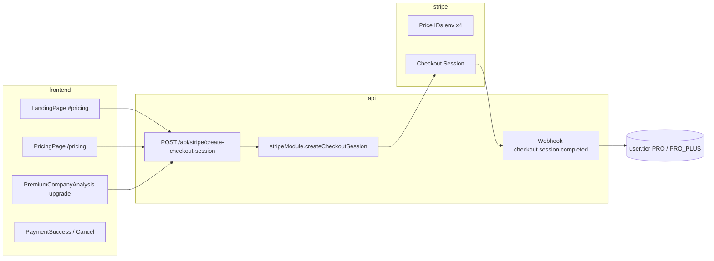

# Audyt pricingu StockAI Pro - migracja USD -> EUR

**Data audytu:** 2026-05-22  
**Ostatnia aktualizacja:** PRICING.1 (2026-05-25) - trial-first EUR model foundation  
**Zakres:** `apps/frontend` (pełny przegląd), `apps/api` (tylko odczyt, bez zmian kodu)  
**Cel:** inwentaryzacja miejsc z cenami / USD / checkoutem oraz plan wdrożenia EUR bez implementacji w tym PR.

---

## PRICING.1 - Trial-first EUR foundation (2026-05-25)

**Status:** Config + docs + scoped pricing page copy. **No live Stripe activation.**

### Strategic model

| Element | Decision |
|---------|----------|
| Classic Free plan | **Removed** - no full free product tier |
| Entry | **Trial-first** (7d no card / 14d with card -> paid) |
| Trial expired | Account remains; **Trial Expired Mode** (minimal access) |
| Currency | **EUR** |
| Plans | **Pro €29/mo / €290/yr** / **Pro+ €59/mo / €590/yr** / **Investor OS €99/mo / €990/yr** |
| Founding offers | Document only - not in checkout |
| Single Premium Report €19 | **Future** - documented in `FUTURE_MONETIZATION` |
| AI Credits add-on | **Future** - documented only |

### Source of truth (code)

| File | Purpose |
|------|---------|
| `apps/api/src/config/pricing.ts` | Canonical pricing, trials, access matrix, fair-use placeholders |
| `apps/frontend/src/config/pricing.ts` | Mirror - keep in sync |
| `apps/frontend/src/pages/PricingPage.tsx` | EUR display + trial messaging (checkout still legacy USD Stripe IDs) |

### Trial rules (summary)

1. **Without card:** 7 days / limited Pro+ / limited AI / no Autopilot live / no broker sync / no heavy exports  
2. **With card:** 14 days / Pro+ fair-use / converts to selected paid plan via Stripe  
3. **Trial Expired Mode:** login OK; blocked from AI Brief, Premium, Signals, exports, Autopilot, etc. - see `TRIAL_EXPIRED_ACCESS` in config

### Env placeholders (EUR - not wired)

```
STRIPE_PRICE_PRO_MONTHLY_EUR
STRIPE_PRICE_PRO_YEARLY_EUR
STRIPE_PRICE_PRO_PLUS_MONTHLY_EUR
STRIPE_PRICE_PRO_PLUS_YEARLY_EUR
STRIPE_PRICE_INVESTOR_OS_MONTHLY_EUR
STRIPE_PRICE_INVESTOR_OS_YEARLY_EUR
```

### Remaining implementation (post PRICING.1)

- DB fields: `trial_ends_at`, `trial_kind`, `access_state`
- Middleware: Trial Expired Mode enforcement
- Stripe: EUR Price objects + wire `stripeModule` to new env keys
- i18n: replace $9/$19 across 9 locales
- LandingPage, Terms, waitlist Early Adopter copy

---

## 1. Podsumowanie wykonawcze

| Obszar | Stan |
|--------|------|
| Waluta rozliczeń (docelowa) | **USD** w UI, Terms i copy Stripe |
| Źródło prawdy kwoty przy płatności | **Stripe Price objects** (`STRIPE_*_PRICE_ID` w API) |
| Wyświetlanie cen na froncie | **Hardcoded** w TS (`formatUsdPrice`, `LandingPage`) + **i18n** (`common.json`) |
| Checkout | Podpięty: `POST /api/stripe/create-checkout-session` -> redirect na Stripe |
| Nazewnictwo planów | **Free**, **Pro**, **Pro+** (nie ma planu subskrypcyjnego „Premium”; „Premium Analysis” to moduł produktowy) |

**Główne ryzyko migracji:** frontend może pokazywać EUR, podczas gdy Stripe nadal pobiera kwotę z Price ID w USD (lub odwrotnie), jeśli nie zsynchronizuje się łańcuch: Stripe -> env -> backend mapping -> frontend display -> Terms.

---

## 2. Obecny cennik (kwoty i waluty)

Wszystkie **ceny subskrypcji** w produkcie są dziś prezentowane jako **USD** ze znakiem `$`.

| Plan | Miesięcznie | Rocznie | Rabat roczny (copy w UI) |
|------|------------|---------|---------------------------|
| **Free** | $0/mo | $0/mo | - |
| **Pro** | **$9/mo** | **$79/yr** | ~27% vs 12×$9 ($108) |
| **Pro+** | **$19/mo** | **$149/yr** | ~34% vs 12×$19 ($228) |

**Promocja marketingowa (bez osobnej logiki w kodzie Stripe):**

- **Early Adopter:** pierwsze 500 kont Pro - copy „$9/mo forever” (landing, waitlist, i18n, Terms).

**Inne waluty w aplikacji (poza subskrypcją - nie migrować w tym samym kroku bez decyzji):**

| Kontekst | Waluty | Uwagi |
|----------|--------|--------|
| Paper trading, Alpaca, dashboard quotes | USD (domyślnie `formatCurrency`) | Dane rynkowe, nie cennik SaaS |
| GPW / tax / position size | PLN + USD orientacyjny (~3,95 PLN/USD) | `PLN_PER_USD` w kilku stronach |
| Dywidendy / company metrics | USD, PLN, EUR per issuer | `dividendFormat.ts`, seed companies |
| Insider transactions filter | „> $50k” w copy EN | Nie dotyczy billingu |

**FAQ / copy:** Pro ma **14-dniowy trial** w tekście (`pricingPage`, i18n). W `stripeModule.ts` **brak** `trial_period_days` / subscription trial w kodzie - trial musi być skonfigurowany w obiekcie Stripe Price albo jest wyłącznie obietnicą marketingową (ryzyko compliance).

---

## 3. Architektura pricingu i checkoutu



1. Użytkownik wybiera plan (`pro` | `pro_plus`) i cykl (`monthly` | `yearly`).
2. Frontend wysyła `{ userId, plan, billing }` - **bez kwoty i waluty**.
3. API mapuje na `STRIPE_*_PRICE_ID` i tworzy sesję Stripe.
4. Po webhooku ustawiany jest `tier` w DB (`FREE` | `PRO` | `PRO_PLUS`).

**Wniosek:** Kwoty na stronie są **display-only**. Faktyczna opłata = cena przypisana do Price ID w Stripe Dashboard.

---

## 4. Stripe i zmienne środowiskowe (API, read-only)

| Zmienna | Rola |
|---------|------|
| `STRIPE_SECRET_KEY` | Klient Stripe |
| `STRIPE_WEBHOOK_SECRET` | Weryfikacja webhooków |
| `STRIPE_PRO_MONTHLY_PRICE_ID` | Pro miesięcznie |
| `STRIPE_PRO_YEARLY_PRICE_ID` | Pro rocznie |
| `STRIPE_PROPLUS_MONTHLY_PRICE_ID` | Pro+ miesięcznie |
| `STRIPE_PROPLUS_YEARLY_PRICE_ID` | Pro+ rocznie |

**Pliki:** `apps/api/src/modules/stripe/stripeModule.ts`, `apps/api/.env.example` (linie 99-105), `apps/api/src/routes/stripe.ts`.

**Placeholdery odrzucane przy starcie checkoutu:** `price_pro_monthly`, `price_pro_yearly`, `price_proplus_monthly`, `price_proplus_yearly`.

**Mapowanie tier po webhooku:** `getTierFromPriceId()` porównuje `subscription.items[0].price.id` z env (fallback na placeholdery w mapowaniu).

**URL-e checkout (hardcoded w module, nie z `FRONTEND_BASE_URL`):**

- `success_url`: `https://stock-ai.pro/payment-success?session_id={CHECKOUT_SESSION_ID}`
- `cancel_url`: `https://stock-ai.pro/payment-cancel`

**Endpoint nieużywany przez frontend:** `GET /api/stripe/subscription/:userId` (tylko testy API). Tier w UI pochodzi z obiektu użytkownika po logowaniu (`AuthContext`), nie z pollingu Stripe.

---

## 5. Frontend - gdzie są ceny i USD/$

### 5.1. Źródła display (subskrypcja)

| Plik | Typ | Ceny / waluta |
|------|-----|----------------|
| `apps/frontend/src/pages/PricingPage.tsx` | **Źródło prawdy UI** | `formatUsdPrice()`: $0, $9/mo, $79/yr, $19/mo, $149/yr; „Billed ... in USD”; FAQ Stripe USD; **checkout** |
| `apps/frontend/src/pages/LandingPage.tsx` | Hardcoded w sekcji `#pricing` | Te same kwoty co PricingPage; **checkout** (ignoruje `landing.pricing.tiers.*.price` z i18n) |
| `apps/frontend/public/locales/*/common.json` | i18n (9 języków) | `landing.pricing`, `pricingPage`, `waitlistPage`; ceny $9/$19 w SEO i tierach |
| `apps/frontend/scripts/add-pricing-page-i18n.mjs` | Generator i18n | Szablony USD |
| `apps/frontend/scripts/fix-landing-i18n-overrides.mjs` | Override cen w locale | $9/mo, $19/mo |
| `apps/frontend/scripts/sync-landing-locales.mjs` | Sync | `checkoutError` |

### 5.2. Checkout i ścieżki płatności

| Plik | Zachowanie |
|------|------------|
| `apps/frontend/src/services/api.ts` | `createStripeCheckoutSession()` -> `POST /stripe/create-checkout-session` |
| `apps/frontend/src/pages/PricingPage.tsx` | Pełny flow + `localStorage.checkout_plan` |
| `apps/frontend/src/pages/LandingPage.tsx` | `handleChoosePlan` - wymaga `userId` w localStorage |
| `apps/frontend/src/pages/PremiumCompanyAnalysis.tsx` | Upgrade zawsze `plan: "pro"`, `billing: "monthly"` |
| `apps/frontend/src/pages/LoginPage.tsx` | Copy „Sign in to complete subscription” gdy redirect z `/pricing` |
| `apps/frontend/src/pages/PaymentSuccessPage.tsx` | Plan z query lub `checkout_plan`; **brak ceny** |
| `apps/frontend/src/pages/PaymentCancelPage.tsx` | Link powrotu do `/pricing` |

### 5.3. Paywall / upgrade (bez kwoty, CTA -> /pricing)

| Plik | Opis |
|------|------|
| `apps/frontend/src/components/AnalysisBrief.tsx` | Limit AI Brief -> link `/pricing` |
| `apps/frontend/src/components/behavioral-coach/BrokerIntegrationPaywall.tsx` | FREE -> PRO+ broker integration |
| `apps/frontend/src/pages/BehavioralCoachPage.tsx` | Warunek `isFreePlan(user?.tier)` |
| `apps/frontend/src/pages/PremiumCompanyAnalysis.tsx` | Blokada ekranów + checkout Pro |
| `apps/frontend/src/stores/premiumAnalysisStore.ts` | Komunikat limitu miesięcznego |
| `apps/frontend/src/components/AIBriefDrawer.tsx` | CTA alerts -> premium lub `/pricing` |

### 5.4. Ustawienia / profil / pomoc

| Plik | Opis |
|------|------|
| `apps/frontend/src/pages/SettingsPage.tsx` | Sekcja Subscription: tier z `user.tier`; przycisk „Upgrade plan” **bez** `onClick` / linku |
| `apps/frontend/src/pages/ProfilePage.tsx` | Badge planu + link Upgrade -> `/pricing` |
| `apps/frontend/src/pages/HelpPage.tsx` | FAQ billing Free vs Pro (bez kwot) |
| `apps/frontend/src/pages/WaitlistPage.tsx` | Early Adopter $9/mo w copy |

### 5.5. Plan config (funkcje, nie ceny)

| Plik | Opis |
|------|------|
| `apps/frontend/src/pages/PricingPage.tsx` | `PLAN_FEATURE_ACCESS` - macierz funkcji Free/Pro/Pro+ |
| `apps/frontend/src/utils/subscriptionTier.ts` | `normalizeUserPlan`: FREE \| PRO \| PRO+ |
| `apps/frontend/src/pages/AdminPage.tsx` | Ręczna zmiana tier (FREE/PRO/PRO_PLUS) |

### 5.6. Legal

| Plik | Treść USD |
|------|-----------|
| `apps/frontend/src/content/termsSections.tsx` | §4: 9/79/19/149 USD, Stripe, Early Adopter 9 USD/mies. |
| `apps/frontend/src/content/privacyPolicySections.tsx` | Stripe billing data (bez kwot) |

### 5.7. Routing

`apps/frontend/src/App.tsx`: `/pricing`, `/payment-success`, `/payment-cancel`.

---

## 6. Backend - limity planów (bez cen, read-only)

Ceny nie występują w API; tier steruje limitami:

| Mechanizm | FREE | PRO | PRO_PLUS |
|-----------|------|-----|----------|
| AI Brief dzienny (`aiBriefRateLimit.ts`) | 3/dzień | 15/dzień (env) | 40/dzień (env) |
| Premium Analysis miesięcznie (`rateLimiter.ts`) | 10/mies. | unlimited | unlimited |
| Premium LLM story/catch (`premiumLlmRateLimit.ts`) | blocked | 8/dzień | 25/dzień |
| Frontend Premium Analysis (`PremiumCompanyAnalysis.tsx`) | 1 ekran | 5/mies. (local) | unlimited |

**Admin:** `apps/api/src/routes/admin.ts` - tier `FREE` \| `PRO` \| `PRO_PLUS`.

---

## 7. Niespójności i ryzyka (frontend vs checkout)

1. **Display ≠ Stripe:** Zmiana tekstu na EUR bez nowych Price ID w Stripe -> użytkownik płaci starą kwotę/walutę.
2. **Landing i18n vs kod:** `landing.pricing.tiers.pro.price` w JSON ($9/mo) **nie jest używane** - `LandingPage` ma własne literały.
3. **Podwójna definicja cen:** `PricingPage.formatUsdPrice` + `LandingPage` inline + 9× locale - łatwo o rozjazd przy EUR.
4. **Early Adopter $9 forever:** Tylko marketing/Terms; brak osobnego Price ID ani flagi w DB w audycie kodu.
5. **14-day trial:** Copy bez implementacji w `createCheckoutSession`.
6. **PremiumCompanyAnalysis upgrade:** Zawsze Pro monthly - użytkownik na paywallu Pro+ nie dostaje checkout Pro+.
7. **Settings „Upgrade plan”:** Przycisk bez nawigacji do `/pricing`.
8. **Success/Cancel URL:** Na sztywno `stock-ai.pro` - staging/local wymaga osobnej konfiguracji przy migracji.
9. **`GET /api/stripe/subscription`:** Nieużywany w frontendzie - brak wyświetlania „następnej płatności” / waluty z Stripe.
10. **Nazwa „Premium”:** W UI produkt „Premium Analysis”; plan najwyższy to **Pro+** - przy komunikacji EUR unikać mylenia z osobnym tierem „Premium”.

---

## 8. Pliki do zmiany przy migracji EUR (checklista)

### Must-have (subskrypcja + checkout)

| Warstwa | Pliki / akcje |
|---------|----------------|
| Stripe Dashboard | Nowe Products/Prices w **EUR** (4 cykle); ewentualnie trial na Price |
| Env / secrets | `STRIPE_*_PRICE_ID` ×4 w prod/staging |
| API | `stripeModule.ts` - opcjonalnie `currency` w logach; URL success/cancel per env; ewentualnie Customer Portal |
| Frontend display | `PricingPage.tsx`, `LandingPage.tsx` - formatter waluty (np. `formatPlanPrice`) |
| i18n | `apps/frontend/public/locales/*/common.json` - wszystkie klucze z $ i USD |
| Skrypty i18n | `add-pricing-page-i18n.mjs`, `fix-landing-i18n-overrides.mjs`, `sync-landing-locales.mjs` |
| Legal | `termsSections.tsx` (+ ewentualnie Privacy jeśli dodacie walutę rozliczeń) |
| SEO | `pricingPage.seo`, `landing` meta gdzie są $9/$19 |

### Should-have (spójność UX)

| Plik | Powód |
|------|--------|
| `WaitlistPage.tsx` | Early Adopter copy |
| `PremiumCompanyAnalysis.tsx` | Upgrade powinien respektować docelowy plan |
| `SettingsPage.tsx` | Podpiąć Upgrade -> `/pricing` |
| `PaymentSuccessPage.tsx` | Opcjonalnie waluta/kwota z sesji Stripe (przyszłość) |

### Nie zmieniać w pierwszym kroku (bez osobnej decyzji biznesowej)

- `PaperTradingPage`, `AlpacaPage`, `formatCurrency` domyślne USD dla rynku  
- `dividendFormat`, GPW PLN/USD indicative  
- `InsiderMirrorPage` formatUsd dla wielkości transakcji  

---

## 9. Rekomendowana kolejność wdrożenia

1. **Decyzja biznesowa** - pakiety (Free / Pro / Pro+), kwoty EUR, rabat roczny, Early Adopter, trial, czy Pro+ zostaje pod tą nazwą czy rebrand na „Premium”.
2. **Stripe EUR Price IDs** - utworzenie 4 cen EUR; test webhooków na stagingu; Customer Portal / anulowanie zgodne z Terms.
3. **Backend plan config** - podmiana env, weryfikacja `getTierFromPriceId`, opcjonalnie trial w `subscription_data`; poprawka URL success/cancel pod środowisko.
4. **Frontend display** - jeden moduł cen (usuń duplikację Landing vs Pricing vs i18n); przełącznik monthly/yearly bez zmiany kontraktu API (`plan` + `billing`).
5. **Terms / Privacy / legal** - kwoty w PLN/EUR, waluta rozliczeń, odstąpienie 14 dni, Stripe; język polski + EN.
6. **Smoke test checkout** - Free user -> Pro monthly/yearly, Pro+ ; webhook -> tier w DB; Payment Success; anulowanie; porównanie kwoty na Stripe Receipt vs UI.

---

## 10. Propozycja struktury planów (NIE wdrożone - do akceptacji biznesowej)

> Poniższe kwoty EUR są **przykładowe** (przeliczenie ~ parity lub psychologiczne zaokrąglenia). Zastąp po decyzji produktowej.

| Plan | Miesięcznie (prop.) | Rocznie (prop.) | Uwagi |
|------|---------------------|-----------------|--------|
| **Free** | €0 | €0 | Bez zmian zakresu funkcji bazowych |
| **Pro** | €9/mo | €79/yr (~27%) | Odpowiednik obecnego Pro |
| **Premium** (obecne **Pro+**) | €19/mo | €149/yr (~35%) | Rozważyć rename UI „Pro+” -> „Premium” tylko jeśli marketing tego wymaga - wymaga migracji stringów i `pro_plus` w API |
| **Early Adopter** (opcjonalnie) | €9/mo locked | - | Wymaga dedykowanego Stripe Price + entitlement w DB |

**Annual discount:** zachować ~27% (Pro) i ~35% (Pro+) względem 12× miesięczna, aby copy „Save 27% / 34%” pozostało prawdziwe po przeliczeniu EUR.

**Mapowanie nazw:** W kodzie dziś `pro_plus` / `PRO_PLUS` / wyświetlane „Pro+”. Plan subskrypcyjny „Premium” w zapytaniu audytowym = **Pro+** w implementacji.

---

## 11. Indeks wyszukiwania (grep) - skrót

Przeszukano m.in.: `USD`, `$`, `/mo`, `monthly`, `yearly`, `pricing`, `plan`, `subscription`, `checkout`, `Stripe`, `priceId`, `Pro`, `Premium`, `Free` w `apps/frontend` i `apps/api`.

**Kluczowe trafienia API (poza Stripe):** tier w `auth`, `admin`, `aiBriefRateLimit`, `premiumLlmRateLimit`, `rateLimiter` - bez kwot.

**Frontend dist:** Katalog `apps/frontend/dist/` zawiera zbudowane assety - po migracji EUR przebudować frontend; nie edytować dist ręcznie.

---

## 12. Weryfikacja audytu

Po dodaniu tego dokumentu oczekiwany stan repozytorium:

```bash
git status --short
# powinno pokazywać wyłącznie: ?? docs/PRICING_EUR_MIGRATION.md  (lub M docs/...)
```

Brak zmian w: `apps/api`, `apps/frontend` (kod), Stripe, `.env`, cen liczbowych.

---

*Dokument wygenerowany w ramach audytu read-only. Implementacja migracji EUR wymaga osobnego tasku zgodnie z sekcją 9.*
