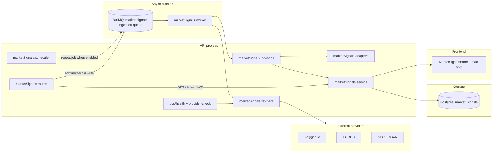

# MarketSignals — Provider & Scheduler Operations Runbook (OPS.1)

**StockAI Pro monorepo**  
**Scope:** MarketSignals provider configuration, entitlement verification, and safe scheduler enablement.  
**Out of scope:** Autopilot, Alpaca, Redis infrastructure changes, Prisma migrations, application code changes.

**Related docs:** [market-signals-qa-runbook.md](./market-signals-qa-runbook.md) (unit tests and S1–S9 smoke matrix).

**Production host:** `https://stock-ai.pro` (nginx → `stockai-api-prod` on port 3000).  
**Production env file:** `/root/aplikacja-gielda/.env.production`

---

## 1. Current architecture summary

MarketSignals ingests institutional activity from external providers, normalizes it into typed signals, persists to Postgres (`market_signals`), and serves read-only data to the frontend.



### 1.1 Adapters (`marketSignals.adapters.ts`)

Map raw provider payloads → normalized `MarketSignalIngestInput` records:

| Provider constant | Adapter | Signal types |
|-------------------|---------|--------------|
| `POLYGON_DARK_POOL` | `parsePolygonDarkPoolPayload` | `DARK_POOL` |
| `POLYGON_OPTIONS_FLOW` | `parsePolygonOptionsFlowPayload` | `OPTIONS_FLOW` |
| `EODHD_INSIDER_ACTIVITY` | `parseEodhdInsiderActivityPayload` | `INSIDER_ACTIVITY` |
| `SEC_FILINGS` | `parseSecFilingPayload` | `SEC_FILING` |

### 1.2 Fetchers (`marketSignals.fetchers.ts`)

Live HTTP calls to provider APIs. Each fetcher reads env keys, applies timeouts (default 8s), redacts secrets in logs, and returns structured fetch results. Used by:

- Manual/admin `POST /provider-fetch-enqueue`
- Worker `fetch-provider-and-ingest` jobs
- Scheduler batch enqueue

### 1.3 Ingestion (`marketSignals.ingestion.ts`)

Orchestrates adapter selection, validation, deduplication, and persistence via `marketSignals.service`. Write paths:

- `POST /api/v1/market-signals/ingest` — manual single signal
- `POST /api/v1/market-signals/provider-ingest` — raw payload ingest
- `POST /api/v1/market-signals/provider-enqueue` — async payload ingest
- `POST /api/v1/market-signals/provider-fetch-enqueue` — fetch + async ingest

All write routes require **admin role** or valid **`x-internal-api-key`**.

### 1.4 BullMQ queue (`marketSignals.queue.ts`)

- **Queue name:** `market-signals-ingestion-queue`
- **Job types:**
  - `ingest-provider-payload` — ingest pre-fetched payload
  - `fetch-provider-and-ingest` — fetch live, then ingest
  - `schedule-market-signals-batch` — scheduler tick; enqueues fetch jobs for configured ticker×provider pairs
- **Defaults:** 2 attempts, exponential backoff 3s, `removeOnComplete: 200`, `removeOnFail: 500`

### 1.5 Worker (`marketSignals.worker.ts`)

Runs inside the API scheduler process (`apps/api/src/scheduler.ts`). Concurrency defaults to `2` (`MARKET_SIGNALS_WORKER_CONCURRENCY`). Logs structured JSON on ready, completed, and failed jobs.

### 1.6 Scheduler — OFF by default (`marketSignals.scheduler.ts`)

- Registered at API startup via `registerMarketSignalsScheduler()` in `scheduler.ts`.
- **Enabled only when** `MARKET_SIGNALS_SCHEDULER_ENABLED=true` (exact string).
- When disabled: logs `market_signals_scheduler_disabled` and does **not** register the repeat job.
- When enabled: adds repeat job `market-signals-scheduler-batch` at `intervalMinutes` (default **240**).
- **Default ticker list** (if env empty when enabled): `AAPL`, `MSFT`, `NVDA`.
- **Default provider list** (if env empty when enabled): all four providers including Polygon — **override explicitly in ops** (see §6).

### 1.7 Frontend — read-only panel

`MarketSignalsPanel` (`apps/frontend/src/components/market-signals/`) calls `GET /api/v1/market-signals/:ticker` with the user's JWT. No write UI. Wired from company detail (Signals tab).

### 1.8 Admin / internal guard

`requireAdminOrInternal` middleware protects:

- All write endpoints (`/ingest`, `/provider-ingest`, `/provider-enqueue`, `/provider-fetch-enqueue`)
- Ops endpoints (`/ops/health`, `/ops/provider-check`)

Access granted when **any** of:

1. JWT user has `role: ADMIN`
2. Request includes `x-internal-api-key` matching `INTERNAL_API_KEY`
3. Non-production `x-dev-admin-override: true` (ignored in production)

Normal authenticated users receive **403** `ADMIN_OR_INTERNAL_REQUIRED` on ops/write routes.

---

## 2. Environment variables

Set in `.env.production` on the VPS (or local `.env` for dev). After any change, **restart the API container** (see §3.3).

| Variable | Required | Purpose |
|----------|----------|---------|
| `INTERNAL_API_KEY` | **Yes** (ops) | Shared secret for `x-internal-api-key` header on admin/internal routes. Must match between operator shell and API process. |
| `EODHD_API_KEY` | For EODHD ingest | EODHD insider-transactions API token. |
| `POLYGON_API_KEY` | For Polygon ingest | Polygon.io API key. Valid key ≠ entitled plan (see §4). |
| `SEC_USER_AGENT` | For SEC ingest | SEC-mandated User-Agent string, e.g. `StockAI/1.0 contact@yourdomain.com`. Without it, SEC fetcher is disabled. |
| `MARKET_SIGNALS_SCHEDULER_ENABLED` | No | `true` to enable scheduler repeat job. **Default: disabled** (unset or any value other than `true`). |
| `MARKET_SIGNALS_SCHEDULER_TICKERS` | No | Comma-separated tickers, e.g. `MSFT,NVDA,AAPL`. Max count capped by `MAX_TICKERS`. |
| `MARKET_SIGNALS_SCHEDULER_PROVIDERS` | No | Comma-separated provider constants, e.g. `EODHD_INSIDER_ACTIVITY`. |
| `MARKET_SIGNALS_SCHEDULER_INTERVAL_MINUTES` | No | Repeat interval in minutes. Default **240** (4 hours). |
| `MARKET_SIGNALS_SCHEDULER_MAX_TICKERS` | No | Upper bound on tickers parsed from `SCHEDULER_TICKERS`. Default **25**. |
| `MARKET_SIGNALS_ALLOW_POLYGON_SCHEDULER` | **Proposed** | **Not implemented in codebase yet.** Intended safety gate: when `false`, scheduler skips Polygon providers even if listed in `SCHEDULER_PROVIDERS`. Until shipped, **omit Polygon from `MARKET_SIGNALS_SCHEDULER_PROVIDERS` manually**. |

Optional worker tuning (not in original checklist but present in code):

| Variable | Default | Purpose |
|----------|---------|---------|
| `MARKET_SIGNALS_WORKER_CONCURRENCY` | `2` | BullMQ worker parallelism for `market-signals-ingestion-queue`. |

Also required for the pipeline (not MarketSignals-specific): `DATABASE_URL`, `REDIS_URL`, `JWT_SECRET`.

---

## 3. Safe key handling

### 3.1 Never paste secrets into chat

Do not paste API keys, `INTERNAL_API_KEY`, JWTs, or DB passwords into Slack, tickets, or AI chat. Reference variable **names** only.

### 3.2 Load secrets in shell without echo

On the VPS (bash):

```bash
cd /root/aplikacja-gielda
set -a
source .env.production
set +a

# Read sensitive values without printing (bash)
read -s -p "INTERNAL_API_KEY: " INTERNAL_API_KEY
echo
read -s -p "POLYGON_API_KEY: " POLYGON_API_KEY
echo
```

PowerShell (local ops — prefer VPS for production keys):

```powershell
$InternalKey = Read-Host "INTERNAL_API_KEY" -AsSecureString
# Convert to plain string only in-memory for curl headers; do not log.
```

### 3.3 Verify configuration by length/count only

```bash
# Safe checks — no secret values printed
[ -n "$INTERNAL_API_KEY" ] && echo "INTERNAL_API_KEY: set (len=${#INTERNAL_API_KEY})" || echo "INTERNAL_API_KEY: MISSING"
[ -n "$EODHD_API_KEY" ] && echo "EODHD_API_KEY: set (len=${#EODHD_API_KEY})" || echo "EODHD_API_KEY: MISSING"
[ -n "$POLYGON_API_KEY" ] && echo "POLYGON_API_KEY: set (len=${#POLYGON_API_KEY})" || echo "POLYGON_API_KEY: MISSING"
[ -n "$SEC_USER_AGENT" ] && echo "SEC_USER_AGENT: set (len=${#SEC_USER_AGENT})" || echo "SEC_USER_AGENT: MISSING"
grep -E '^MARKET_SIGNALS_SCHEDULER_' .env.production || echo "No MARKET_SIGNALS_SCHEDULER_* overrides (scheduler disabled by default)"
```

Expected production state today:

- `EODHD_API_KEY` — configured, working
- `POLYGON_API_KEY` — configured, key valid but plan lacks trades/options entitlement
- `INTERNAL_API_KEY` — deployed
- `MARKET_SIGNALS_SCHEDULER_ENABLED` — unset or `false`

### 3.4 Restart API after env changes

```bash
cd /root/aplikacja-gielda
docker compose -f docker-compose.prod.yml up -d --force-recreate api
docker logs stockai-api-prod --tail 50 | grep -E 'scheduler|market_signals'
```

Confirm log line: `MarketSignals scheduler disabled` unless you intentionally enabled it.

---

## 4. Provider readiness

Two diagnostics endpoints — **different depth**:

| Endpoint | Type | Auth |
|----------|------|------|
| `GET /api/v1/market-signals/ops/health` | Cheap env-level + queue/DB stats | JWT + `x-internal-api-key` (or admin) |
| `GET /api/v1/market-signals/ops/provider-check?provider=…&ticker=…` | Live HTTP probes to providers | JWT + `x-internal-api-key` (or admin) |

Query params for provider-check:

- `provider` — `POLYGON`, `EODHD`, `SEC`, or `ALL`
- `ticker` — defaults to `AAPL`; must match `/^[A-Z0-9.\-]{1,16}$/i`

### 4.1 `/ops/health` — env-level diagnostics

Returns JSON with:

- `scheduler` — enabled flag, tickers, providers, interval
- `providerReadiness` — **boolean flags from env only** (key present = usable)
- `queue` — BullMQ job counts (`waiting`, `active`, `delayed`, `completed`, `failed`)
- `database` — signal counts 24h/7d, breakdown by type/source
- `warnings` — always includes: *"Provider readiness in this endpoint is env-level only; use GET /ops/provider-check for live entitlement."*

Use health for: scheduler state, queue backlog, DB ingestion volume, missing env keys.

### 4.2 `/ops/provider-check` — live entitlement diagnostics

Makes real outbound requests. Response always HTTP **200** with `ok: true` when the check itself succeeds (individual endpoints may fail).

#### HTTP status interpretation

| Status | Meaning |
|--------|---------|
| **200** | Request succeeded; for entitled endpoints, `entitled: true` |
| **401** | Invalid or rejected API key |
| **403** | Key valid but plan lacks access to that endpoint |
| **null** + `errorCode` | Network/timeout/missing key (`MISSING_API_KEY`, `TIMEOUT`, etc.) |

#### Polygon

Probes three endpoints in parallel:

| Field | Endpoint | Current production expectation |
|-------|----------|--------------------------------|
| `referenceTicker` | `/v3/reference/tickers/{ticker}` | **200**, `ok: true` → key is **valid** |
| `tradesEndpoint` | `/v3/trades/{ticker}` | **403**, `entitled: false` → plan lacks trades |
| `optionsSnapshotEndpoint` | `/v3/snapshot/options/{ticker}` | **403**, `entitled: false` → plan lacks options |

**Decision rule:**

- `referenceTicker.httpStatus === 200` → key works
- `tradesEndpoint` or `optionsSnapshotEndpoint` with **403** → upgrade Polygon plan before scheduler includes `POLYGON_DARK_POOL` or `POLYGON_OPTIONS_FLOW`
- `usableForMarketSignals: true` only when **trades OR options** returns 200 with `entitled: true`
- **Do not enable Polygon in scheduler** until `usableForMarketSignals === true`

#### EODHD

Probes insider-transactions for `{ticker}.US`:

- **200** with empty JSON array `[]` → **still usable** (`usableForMarketSignals: true`, `hasData: false`)
- **200** with rows → usable with data
- **401** → invalid token

#### SEC

Requires `SEC_USER_AGENT`:

- Resolves CIK from `company_tickers.json`, then probes submissions JSON
- `usableForMarketSignals: true` when user agent configured and submissions return 200
- Missing `SEC_USER_AGENT` → fetcher disabled; warning in response

---

## 5. Smoke-test commands

End-to-end verification on production (or staging). Uses a **disposable test user** — never reuse production admin credentials in scripts.

### 5.1 Variables

```bash
export BASE_URL="https://stock-ai.pro"          # or http://localhost:3000
export TEST_EMAIL="ms-ops-test-$(date +%s)@example.com"
export TEST_PASSWORD="OpsTestPass123!"
export TEST_NAME="MS Ops Smoke"
```

Load ops secrets without printing:

```bash
cd /root/aplikacja-gielda
set -a && source .env.production && set +a
# INTERNAL_API_KEY already in environment from .env.production
```

### 5.2 Create test user

```bash
curl -sS -X POST "$BASE_URL/api/auth/register" \
  -H "Content-Type: application/json" \
  -d "{\"email\":\"$TEST_EMAIL\",\"password\":\"$TEST_PASSWORD\",\"name\":\"$TEST_NAME\"}" | jq .
```

Expect **201** and `verificationEmailSent: true`.

### 5.3 Verify email

Email may not reach `example.com`. Read verification token from DB on VPS:

```bash
VERIFY_TOKEN=$(docker exec stockai-timescaledb-prod psql -U postgres -d stockai -t -A \
  -c "SELECT verify_token FROM users WHERE email = '$TEST_EMAIL' LIMIT 1;")

curl -sS "$BASE_URL/api/auth/verify?token=$VERIFY_TOKEN" -H "Accept: application/json" | jq .
```

Expect `{ "verified": true }`.

### 5.4 Login → JWT

```bash
LOGIN_JSON=$(curl -sS -X POST "$BASE_URL/api/auth/login" \
  -H "Content-Type: application/json" \
  -d "{\"email\":\"$TEST_EMAIL\",\"password\":\"$TEST_PASSWORD\"}")

export USER_JWT=$(echo "$LOGIN_JSON" | jq -r .token)
echo "JWT length: ${#USER_JWT}"
```

Expect non-empty token; do not echo the token in tickets.

### 5.5 Call `/ops/health`

```bash
curl -sS "$BASE_URL/api/v1/market-signals/ops/health" \
  -H "Authorization: Bearer $USER_JWT" \
  -H "x-internal-api-key: $INTERNAL_API_KEY" | jq .
```

Expect **200**, `scheduler.enabled` matches env, `warnings` array present.

**Negative checks:**

```bash
# 401 — no JWT
curl -sS -o /dev/null -w "%{http_code}\n" "$BASE_URL/api/v1/market-signals/ops/health"

# 403 — JWT without internal key
curl -sS -o /dev/null -w "%{http_code}\n" \
  -H "Authorization: Bearer $USER_JWT" \
  "$BASE_URL/api/v1/market-signals/ops/health"
```

### 5.6 Call `/ops/provider-check`

```bash
# Polygon entitlement (current plan: reference 200, trades/options 403)
curl -sS "$BASE_URL/api/v1/market-signals/ops/provider-check?provider=POLYGON&ticker=AAPL" \
  -H "Authorization: Bearer $USER_JWT" \
  -H "x-internal-api-key: $INTERNAL_API_KEY" | jq .

# EODHD (expect usableForMarketSignals true)
curl -sS "$BASE_URL/api/v1/market-signals/ops/provider-check?provider=EODHD&ticker=AAPL" \
  -H "Authorization: Bearer $USER_JWT" \
  -H "x-internal-api-key: $INTERNAL_API_KEY" | jq .

# All providers
curl -sS "$BASE_URL/api/v1/market-signals/ops/provider-check?provider=ALL&ticker=MSFT" \
  -H "Authorization: Bearer $USER_JWT" \
  -H "x-internal-api-key: $INTERNAL_API_KEY" | jq .
```

### 5.7 Read path (normal user)

```bash
curl -sS "$BASE_URL/api/v1/market-signals/AAPL" \
  -H "Authorization: Bearer $USER_JWT" | jq '{ ticker, summary, signalCount: (.signals | length) }'
```

### 5.8 Cleanup test user

```bash
docker exec stockai-timescaledb-prod psql -U postgres -d stockai -c \
  "DELETE FROM users WHERE email = '$TEST_EMAIL';"
```

Optionally delete test signals only if tagged with a known test `source` or `reason` (see §6.5). **Do not bulk-delete production `market_signals`.**

---

## 6. Scheduler enablement policy

**Prerequisite:** §5 smoke tests pass; `provider-check` results documented; ops health shows acceptable queue/DB state.

### 6.1 Rules

1. **Never enable all providers at once** on first run.
2. **Start with EODHD only:** `MARKET_SIGNALS_SCHEDULER_PROVIDERS=EODHD_INSIDER_ACTIVITY`
3. **Low ticker list first:** `MARKET_SIGNALS_SCHEDULER_TICKERS=MSFT,NVDA,AAPL` (3 tickers → 3 jobs per cycle)
4. **One cycle test** — use a short interval temporarily (e.g. `MARKET_SIGNALS_SCHEDULER_INTERVAL_MINUTES=60`) only for the test window, then restore production interval
5. **Exclude Polygon** until `checks.polygon.usableForMarketSignals === true` on provider-check
6. **Exclude SEC** until `SEC_USER_AGENT` is set and provider-check passes
7. When `MARKET_SIGNALS_ALLOW_POLYGON_SCHEDULER` ships, set it `false` until Polygon entitlement is confirmed

### 6.2 Recommended first-enable env block

Add to `.env.production`:

```bash
MARKET_SIGNALS_SCHEDULER_ENABLED=true
MARKET_SIGNALS_SCHEDULER_TICKERS=MSFT,NVDA,AAPL
MARKET_SIGNALS_SCHEDULER_PROVIDERS=EODHD_INSIDER_ACTIVITY
MARKET_SIGNALS_SCHEDULER_INTERVAL_MINUTES=240
MARKET_SIGNALS_SCHEDULER_MAX_TICKERS=25
# MARKET_SIGNALS_ALLOW_POLYGON_SCHEDULER=false   # proposed — not in code yet
```

Restart API (§3.4). Confirm logs: `market_signals_scheduler_started` with expected tickers/providers.

### 6.3 One-cycle test procedure

1. Enable scheduler (§6.2) and restart API.
2. Wait one interval **or** trigger manually via admin fetch-enqueue for a single pair (safer for first test):

```bash
curl -sS -X POST "$BASE_URL/api/v1/market-signals/provider-fetch-enqueue" \
  -H "Authorization: Bearer $USER_JWT" \
  -H "x-internal-api-key: $INTERNAL_API_KEY" \
  -H "Content-Type: application/json" \
  -d '{"provider":"EODHD_INSIDER_ACTIVITY","ticker":"AAPL","reason":"ops-one-cycle-test"}' | jq .
```

3. **Check queue failed jobs:**

```bash
curl -sS "$BASE_URL/api/v1/market-signals/ops/health" \
  -H "Authorization: Bearer $USER_JWT" \
  -H "x-internal-api-key: $INTERNAL_API_KEY" | jq '.queue'
```

Or via Redis/BullMQ:

```bash
docker exec stockai-api-prod node -e "
  import('bullmq').then(async ({ Queue }) => {
    const q = new Queue('market-signals-ingestion-queue', { connection: process.env.REDIS_URL });
    console.log(await q.getJobCounts('waiting','active','delayed','completed','failed'));
    await q.close();
  });
"
```

4. **Check DB counts:**

```bash
docker exec stockai-timescaledb-prod psql -U postgres -d stockai -c "
  SELECT COUNT(*) AS total_24h FROM market_signals WHERE created_at > NOW() - INTERVAL '24 hours';
  SELECT source, signal_type, COUNT(*) FROM market_signals
    WHERE created_at > NOW() - INTERVAL '24 hours'
    GROUP BY source, signal_type ORDER BY COUNT(*) DESC;
"
```

Also compare `database` section from `/ops/health`.

5. **Inspect worker logs:**

```bash
docker logs stockai-api-prod --since 30m 2>&1 | grep market_signals_worker
```

Look for `market_signals_worker_job_completed` with `savedCount > 0` or benign `skippedIngest` when provider returned empty payload.

### 6.4 Adding providers incrementally

| Step | Add to `SCHEDULER_PROVIDERS` | Gate |
|------|------------------------------|------|
| 1 | `EODHD_INSIDER_ACTIVITY` | EODHD provider-check `usableForMarketSignals: true` |
| 2 | `SEC_FILINGS` | SEC provider-check passes; rate-limit aware |
| 3 | `POLYGON_DARK_POOL` | Polygon `usableForMarketSignals: true` |
| 4 | `POLYGON_OPTIONS_FLOW` | Same Polygon entitlement |

After each addition: one cycle, verify queue/DB, then proceed.

### 6.5 Cleanup test data

Only delete rows you created during ops testing:

```sql
-- Example: remove signals from a manual test reason (if stored in source/metadata)
-- Prefer filtering by time window + source after one-cycle test
SELECT id, ticker, source, title, created_at FROM market_signals
  WHERE created_at > NOW() - INTERVAL '1 hour'
  ORDER BY created_at DESC LIMIT 20;

-- DELETE only after confirming rows are test data
-- DELETE FROM market_signals WHERE id IN ('...');
```

**Never delete production signals** unless explicitly test-tagged and approved.

---

## 7. Rollback

Use when scheduler misbehaves, provider costs spike, or bad data appears.

### 7.1 Immediate containment

```bash
cd /root/aplikacja-gielda

# Disable scheduler
sed -i 's/^MARKET_SIGNALS_SCHEDULER_ENABLED=.*/MARKET_SIGNALS_SCHEDULER_ENABLED=false/' .env.production
# Or comment/remove the line entirely

docker compose -f docker-compose.prod.yml up -d --force-recreate api
```

### 7.2 Verify rollback

```bash
docker logs stockai-api-prod --tail 30 | grep -i market_signals_scheduler

curl -sS "$BASE_URL/api/v1/market-signals/ops/health" \
  -H "Authorization: Bearer $USER_JWT" \
  -H "x-internal-api-key: $INTERNAL_API_KEY" | jq '.scheduler.enabled, .queue'
```

Expect `scheduler.enabled: false`. Existing repeat job in Redis may remain until TTL — failed/waiting jobs should not grow after disable.

### 7.3 Inspect BullMQ counts

See §6.3 queue inspection. Target: `failed` not increasing; `active` returns to 0.

### 7.4 Data retention

- **Do not** flush Redis in production (other queues depend on it).
- **Do not** delete production `market_signals` unless rows are confirmed test-only.
- Document rollback time, env snapshot, and queue counts in incident log.

### 7.5 Re-enable criteria

Re-run §5 smoke tests and [market-signals-qa-runbook.md](./market-signals-qa-runbook.md) §2.3 (S1–S9). Scheduler stays off until sign-off.

---

## 8. Risk register

| Risk | Impact | Mitigation |
|------|--------|------------|
| **Provider costs** | EODHD/Polygon bill per call; scheduler multiplies by tickers × providers × intervals | Start EODHD-only, 3 tickers; monitor billing dashboards; keep interval ≥ 240 min in prod |
| **Rate limits** | SEC EDGAR enforces User-Agent and request rate; Polygon/EODHD tier limits | SEC: proper `SEC_USER_AGENT`, low concurrency; backoff on 429; stagger providers |
| **Bad entitlements** | 403/401 loops enqueue fetch jobs that skip ingest or fail | Run `/ops/provider-check` before each provider add; never rely on `/ops/health` alone for Polygon |
| **Empty payloads** | Provider returns 200 with no rows → zero signals saved; looks "broken" to users | Expected for illiquid tickers; check `savedCount` in worker logs; EODHD empty array is OK |
| **Noisy signals** | Low-quality or duplicate institutional alerts erode trust | Adapters apply confidence scoring and dedupe keys; review `byType24h` after enablement |
| **User trust / data quality** | Premium UI shows empty or stale panel | Keep scheduler off until at least one provider proven; communicate "institutional context" not trading advice |
| **Default scheduler providers** | If enabled with empty `SCHEDULER_PROVIDERS`, code defaults include Polygon | **Always set explicit `SCHEDULER_PROVIDERS`** when enabling |
| **Secret leakage** | Keys in logs, chat, or curl history | §3 safe handling; provider-check redacts URLs; never paste secrets |

---

## 9. Quick reference — API routes

| Method | Path | Auth | Notes |
|--------|------|------|-------|
| GET | `/api/v1/market-signals/:ticker` | User JWT | Read-only list + summary |
| GET | `/api/v1/market-signals/ops/health` | Admin/internal | Env + queue + DB stats |
| GET | `/api/v1/market-signals/ops/provider-check` | Admin/internal | Live provider probes |
| POST | `/api/v1/market-signals/ingest` | Admin/internal | Manual signal |
| POST | `/api/v1/market-signals/provider-ingest` | Admin/internal | Raw payload |
| POST | `/api/v1/market-signals/provider-enqueue` | Admin/internal | Async payload |
| POST | `/api/v1/market-signals/provider-fetch-enqueue` | Admin/internal | Fetch + async ingest |

---

## 10. Sign-off checklist

| Step | Date | Operator | Pass |
|------|------|----------|------|
| Env keys present (length check only) | | | ☐ |
| §5 smoke test (user create → ops → cleanup) | | | ☐ |
| Provider-check: EODHD usable | | | ☐ |
| Provider-check: Polygon reference 200, trades/options 403 documented | | | ☐ |
| Scheduler remains **disabled** OR controlled enablement per §6 | | | ☐ |
| Rollback procedure understood | | | ☐ |

**Approved to enable scheduler:** ☐ Yes ☐ No — Signature: _______________
