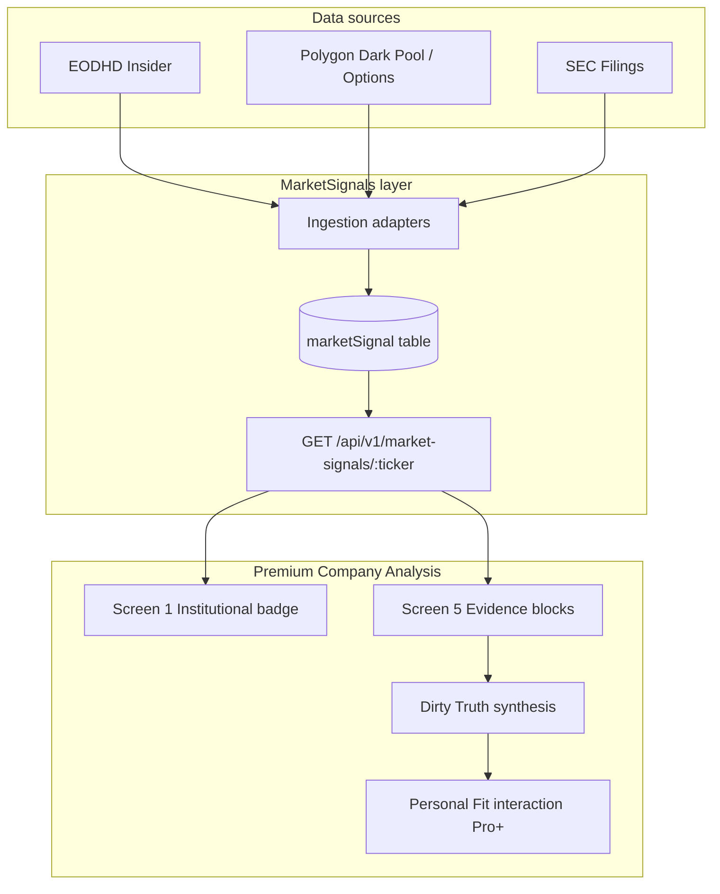

# MarketSignals × Premium Company Analysis — Integration Spec (STEP 6.0)

**StockAI Pro — Institutional Intelligence & Dirty Truth Evidence Layer**  
**Date:** 2026-05-24  
**Status:** Product / technical spec (documentation only — no runtime changes)  
**Authoring context:** Agent 5, STEP 6.0

---

## Executive summary

MarketSignals is **technically implemented** and **read-only** in the product today. This spec defines how to integrate it into **Premium Company Analysis** as **Institutional Intelligence** — contextual evidence that strengthens **What's the Catch** and **The Dirty Truth**, without becoming buy/sell advice or a trading execution layer.

| Area | Current state |
|------|---------------|
| EODHD Insider Activity | Working (`EODHD_INSIDER_ACTIVITY`) |
| Polygon trades / options | Requires plan upgrade (403 on entitled endpoints) |
| Frontend panel | `MarketSignalsPanel` on CompanyDetail → Signals tab |
| Provider diagnostics | `GET /api/v1/market-signals/ops/provider-check` |
| Scheduler | **OFF by default** (`MARKET_SIGNALS_SCHEDULER_ENABLED`) |
| Premium Analysis | 5-screen flow exists; Dirty Truth today is fundamentals-only |

**Out of scope for this integration:** Autopilot, Alpaca, Redis changes, Prisma migrations, scheduler dependency, frontend write endpoints, raw provider payload exposure in Premium UI.

---

## 1. Product positioning

### 1.1 What MarketSignals is

MarketSignals is **institutional context and evidence** — reported filings, disclosed insider transactions, observed dark-pool prints, and unusual options activity — presented with conservative interpretation rules.

It answers: *"What institutional or regulatory activity has been **detected** around this company recently?"*

It does **not** answer: *"Should I buy or sell?"*

### 1.2 What MarketSignals is not

| Not this | Why |
|----------|-----|
| Buy/sell advice | Violates product safety posture; Verdict remains deterministic |
| Smart-money oracle | Direction is rarely provable from a single signal |
| Autopilot input | No order routing, no Alpaca, no execution |
| Real-time trading feed | Data is ingest-on-demand / manual ops; scheduler optional |

### 1.3 Strategic fit with Premium Company Analysis

Premium Analysis is **verdict-first, insight-second**. MarketSignals strengthens two moat pillars:

1. **Brutal truth as a feature** — Screen 5 (*What's the Catch* / *Dirty Truth*) gains **evidence-backed** institutional red flags instead of fundamentals-only heuristics.
2. **Data + behavioral interpretation** — StockAI's differentiation is not raw feeds; it is **curated evidence + conservative framing + Personal Fit context** (Pro+).



### 1.4 Relationship to Verdict Score

Institutional evidence may **inform narrative and Dirty Truth** but must **not** silently override the deterministic Verdict composite on Screen 1. At most, Screen 1 shows a **non-directional badge** (e.g. "3 institutional signals detected") — never "insiders are buying → upgrade verdict."

Optional future enhancement (post-STEP 6.5): a capped **bonus sub-score** (0–3 pts of existing 10-pt bonus bucket) only when multi-signal evidence passes strict rules — documented here as **deferred**, not STEP 6.x scope.

---

## 2. UI placement

### 2.1 Existing surface — CompanyDetail Signals tab

**File:** `apps/frontend/src/pages/CompanyDetail.tsx`  
**Component:** `MarketSignalsPanel` (`apps/frontend/src/components/market-signals/MarketSignalsPanel.tsx`)

Already renders:
- Header: "Institutional signals"
- Summary strip (`MarketSignalsSummary`)
- Signal cards (`MarketSignalCard`) with type badge, confidence tier, title, summary, source, optional collapsed payload preview

**Role in integration:** canonical **drilldown destination** when Premium Analysis links "Show institutional evidence."

Query params today: `lookbackDays` (default 30), optional `minConfidence`, optional `signalType`.

### 2.2 Premium Analysis Screen 1 — Verdict

**File:** `apps/frontend/src/components/premium-analysis/Screen1Verdict.tsx`

**New element (STEP 6.2):** compact **Institutional Intelligence badge** below the Verdict score circle.

| Property | Value |
|----------|-------|
| Visibility | All tiers (Free sees teaser only — see §7) |
| Content | Signal count + strongest type label + lookback window |
| Interaction | Tap → scroll/navigate to Screen 5 evidence section OR deep-link to `/company/:ticker?tab=signals` |
| Copy example | "4 institutional signals detected (90d) · Insider Activity" |
| Forbidden | Directional language ("bullish insider flow") |

**Data source:** aggregated institutional evidence endpoint (STEP 6.1), not direct multi-call from frontend.

### 2.3 Premium Analysis Screen 5 — What's the Catch

**Files:**
- `apps/frontend/src/components/premium-analysis/Screen5WhatsTheCatch.tsx`
- `apps/frontend/src/components/premium-analysis/DirtyTruthBox.tsx`

**New elements (STEP 6.2):**

1. **Evidence blocks** — 0–N cards above or within Dirty Truth, one per qualifying signal cluster:
   - `INSIDER_ACTIVITY` block (net activity summary, top transactions)
   - `DARK_POOL` block (large prints, non-directional framing)
   - Optional `OPTIONS_FLOW` / `SEC_FILING` when provider entitled

2. **Dirty Truth upgrade** — when rules engine (STEP 6.3) fires, `DirtyTruthBox` receives:
   - `one_liner` / `details` from rules engine (deterministic)
   - optional AI refinement (STEP 6.4) with **facts-only input**
   - `evidence_link` → SEC EDGAR or Signals tab, never raw payload

**Layout sketch (mobile-first):**

```
┌─────────────────────────────────────┐
│ Screen 5 — What's the Catch         │
├─────────────────────────────────────┤
│ Bull / Bear comparison              │
├─────────────────────────────────────┤
│ THE DIRTY TRUTH                     │
│ [one-liner + details + severity]    │
├─────────────────────────────────────┤
│ Institutional evidence              │
│ ┌ Insider Activity ─────────────┐   │
│ │ Net selling observed (90d)    │   │
│ │ 3 executive sales reported    │   │
│ └───────────────────────────────┘   │
│ ┌ Dark Pool ────────────────────┐   │
│ │ Large block print detected    │   │
│ │ (notional $62M, no direction) │   │
│ └───────────────────────────────┘   │
│ [Show institutional evidence →]     │
├─────────────────────────────────────┤
│ Pre-Mortem context                  │
└─────────────────────────────────────┘
```

### 2.4 Optional drilldown — "Show institutional evidence"

| From | To |
|------|-----|
| Screen 1 badge | Screen 5 evidence section (in-flow) |
| Screen 5 link | `/company/:ticker` with Signals tab active |
| Pro+ Personal Fit mismatch | Highlight institutional evidence if rule matched user's risk profile |

Reuse existing `MarketSignalsPanel`; do **not** duplicate signal rendering in Premium.

### 2.5 Screens intentionally unchanged

| Screen | Reason |
|--------|--------|
| Screen 2 Personal Fit | Institutional evidence **feeds** mismatch copy (Pro+), not standalone UI |
| Screen 3 Cinematic Story | AI may **reference** detected activity in narrative (STEP 6.4), no new widgets |
| Screen 4 Historical Twin | Out of scope unless twin correlation with insider cycles is validated later |

---

## 3. Data model contract

### 3.1 Source endpoint (existing)

```
GET /api/v1/market-signals/:ticker
```

**Auth:** required (`requireAuthMiddleware` on router)  
**Query params:**

| Param | Type | Default | Notes |
|-------|------|---------|-------|
| `lookbackDays` | number | 30 | Clamped 1–365 |
| `minConfidence` | number | 0 | 0–100 |
| `signalType` | enum | — | Filter to one type |

**Response shape:** `MarketSignalsListResponse` (`apps/api/src/modules/market-signals/marketSignals.types.ts`)

```typescript
{
  ticker: string;
  lookbackDays: number;
  signals: MarketSignalDto[];
  summary: MarketSignalsSummary;
}
```

### 3.2 Field mapping — `MarketSignalDto`

| Field | Type | Premium usage | UI default |
|-------|------|---------------|------------|
| `id` | string | Stable key for evidence blocks | Hidden |
| `ticker` | string | Display / routing | Shown in headers |
| `signalType` | enum | Badge, rules routing, block grouping | Shown |
| `source` | string | Attribution ("eodhd-insider-activity") | Shown |
| `confidenceScore` | number 0–100 | Tier badge (high ≥80, medium ≥60) | Shown |
| `title` | string | Card headline | Shown |
| `summary` | string \| null | Body copy | Shown when present |
| `eventTime` | ISO string | Timeline ordering | Shown |
| `rawPayload` | unknown | **Rules engine input only** | **Never shown in Premium** |
| `createdAt` | ISO string | Ops/debug | Hidden |
| `updatedAt` | ISO string | Ops/debug | Hidden |

### 3.3 Field mapping — `MarketSignalsSummary`

| Field | Premium usage |
|-------|---------------|
| `total` | Screen 1 badge count |
| `byType` | Badge secondary label |
| `strongestSignalType` | Badge hint |
| `averageConfidenceScore` | Internal weighting for rules; optional "data quality" footnote |
| `whaleAccumulationDetected` | **Do not surface as "whales buying"** — use only inside WHALE rules (§4.5) |

### 3.4 Supported `signalType` values

```
OPTIONS_FLOW | DARK_POOL | SEC_FILING | WHALE_ACCUMULATION | INSIDER_ACTIVITY | ANALYST_REVISION
```

### 3.5 Provider → signalType mapping

| Provider | signalType(s) | Entitlement today |
|----------|---------------|-------------------|
| `EODHD_INSIDER_ACTIVITY` | `INSIDER_ACTIVITY` | ✅ Working |
| `POLYGON_DARK_POOL` | `DARK_POOL` | ⚠️ Plan upgrade |
| `POLYGON_OPTIONS_FLOW` | `OPTIONS_FLOW` | ⚠️ Plan upgrade |
| `SEC_FILINGS` | `SEC_FILING` | ✅ When user-agent configured |

### 3.6 Proposed aggregation endpoint (STEP 6.1)

New read-only endpoint for Premium — **does not replace** the list endpoint:

```
GET /api/v1/company/:ticker/institutional-evidence?lookbackDays=90
```

**Response (proposed):**

```typescript
{
  ticker: string;
  lookbackDays: number;
  providerCoverage: {
    insiderActivity: boolean;
    darkPool: boolean;
    optionsFlow: boolean;
    secFilings: boolean;
  };
  aggregates: {
    insider: {
      purchaseCount: number;
      saleCount: number;
      netDirection: "net_buying" | "net_selling" | "mixed" | "insufficient_data";
      totalDisclosedPurchaseValue: number | null;
      totalDisclosedSaleValue: number | null;
      executiveSaleCount: number;
      lastPurchaseAt: string | null;
      monthsSinceLastPurchase: number | null;
    };
    darkPool: {
      largePrintCount: number;
      largestNotional: number | null;
      lastEventAt: string | null;
    };
    optionsFlow: {
      unusualActivityCount: number;
      lastEventAt: string | null;
    };
    secFilings: {
      recentFilingCount: number;
      lastForm: string | null;
    };
  };
  topSignals: Array<{
    id: string;
    signalType: MarketSignalType;
    source: string;
    confidenceScore: number;
    title: string;
    summary: string | null;
    eventTime: string;
    interpretation: "positive_evidence" | "caution" | "attention" | "context" | "neutral";
    interpretationNote: string;
  }>;
  dirtyTruthCandidates: Array<{
    ruleId: string;
    severity: "medium" | "high";
    one_liner: string;
    details: string;
    category: "insider" | "governance" | "sentiment" | "regulatory";
    supportingSignalIds: string[];
  }>;
  limitations: string[];
}
```

**Critical:** `rawPayload` is consumed server-side during aggregation and **stripped** from `topSignals`. Frontend never receives full provider blobs in Premium flow.

---

## 4. Signal interpretation rules

Rules apply in the **backend aggregation / rules engine** (STEP 6.1 + 6.3). AI (STEP 6.4) may only rephrase outputs; it may not invent signals.

### 4.1 Global principles

1. **Single signals are weak** — always pair language with uncertainty markers.
2. **Disclosed > inferred** — prefer Form 4 fields parsed by EODHD adapter over headline inference.
3. **Congressional / political trades** — if detected (owner title contains "Senator", "Representative", "Congress", or source tagged `congressional`), label as **"Reported congressional trade"**, not "insider conviction."
4. **Confidence tier** — reuse frontend tiers: high ≥80, medium ≥60, low <60; low-tier signals excluded from Dirty Truth unless corroborated.

### 4.2 `INSIDER_ACTIVITY`

**Parser reference:** `parseEodhdInsiderActivityPayload`, `getEodhdTransactionDirection`, `getEodhdTransactionValue` in `marketSignals.adapters.ts`.

| Condition | Interpretation tag | User-facing framing |
|-----------|-------------------|---------------------|
| Purchase + disclosed value ≥ $1M | `positive_evidence` | "A disclosed insider purchase was reported…" |
| Purchase + undisclosed value | `positive_evidence` (low weight) | "An insider purchase was reported; value was not disclosed." |
| Sale (any size) | `caution` | "An insider sale was reported; sales are often routine (comp, tax, diversification)." |
| Net selling over 90d (aggregate) | `caution` | "Net insider selling was observed over the lookback window." |
| No purchases ≥ N months + sales present | `caution` | Dirty Truth candidate (§5) |
| Repeated executive sales (≥2 C-suite in 90d) | `caution` | Dirty Truth candidate (§5) |

**Explicitly forbidden:** "Insiders are bullish" unless net disclosed purchases exceed net disclosed sales **and** ≥2 independent purchase events.

### 4.3 `DARK_POOL`

**Parser reference:** `parsePolygonDarkPoolPayload` — minimum notional $50M.

| Condition | Interpretation tag | User-facing framing |
|-----------|-------------------|---------------------|
| Single large print ≥ $50M | `attention` | "A large off-exchange block print was observed ($XM notional)." |
| Multiple prints same week | `attention` | "Repeated large block activity was detected." |
| Print without price trend confirmation | `caution` | Dirty Truth candidate — "Activity detected without clear price confirmation." |

**Explicitly forbidden:** Implying direction (accumulation vs distribution) from a single TRF/dark print.

### 4.4 `OPTIONS_FLOW`

**Parser reference:** `parsePolygonOptionsFlowPayload`, `scorePolygonOptionsFlow`.

| Condition | Interpretation tag | User-facing framing |
|-----------|-------------------|---------------------|
| Unusual premium / volume vs OI | `attention` | "Unusual options activity was detected; often speculative." |
| Calls spike + fundamentals weak | `caution` | Dirty Truth candidate — conflicting signals (§5) |
| Requires confirmation | — | Must cross-check with price action or second signal type before elevation to Dirty Truth |

### 4.5 `SEC_FILING`

| Form | Interpretation tag | User-facing framing |
|------|-------------------|---------------------|
| 8-K | `context` | "A material event filing was reported." |
| 10-K / 10-Q | `context` | "Periodic filing detected — review for updated risk factors." |
| Unknown form | `context` | Neutral filing notice |

Filings **support** Dirty Truth when combined with fundamentals (e.g. 8-K + leverage spike), not alone.

### 4.6 `WHALE_ACCUMULATION`

**Detection reference:** `summarizeMarketSignals` — true when:
- ≥2 dark pool signals with confidence ≥75, OR
- ≥1 `WHALE_ACCUMULATION` signal with confidence ≥80, OR
- options + dark pool combo with average confidence ≥70

| Rule | Requirement |
|------|-------------|
| Surface to user | **Only** when `whaleAccumulationDetected === true` **and** ≥2 distinct signal types corroborate |
| Label | "Multi-signal institutional activity detected" |
| Forbidden | "Whales are accumulating" as directional statement |

Standalone `WHALE_ACCUMULATION` ingest type is reserved for future composite signals — treat as **internal flag**, not marketing copy.

### 4.7 `ANALYST_REVISION`

Out of scope for STEP 6.x Dirty Truth unless analyst module already ingested. If present, tag as `context` only.

---

## 5. Dirty Truth rules

### 5.1 Integration with existing detector

Today `detectDirtyTruth()` in `apps/api/src/routes/premiumCompany.ts` evaluates **fundamentals only** (leverage, dilution, receivables, FCF/revenue divergence).

STEP 6.3 **extends** — does not replace — this pipeline:

```
fundamentals candidates ──┐
                          ├── merge & rank by score ──► top Dirty Truth ──► optional AI refine
institutional candidates ─┘
```

Institutional candidates use the same public shape:

```typescript
{
  one_liner: string;
  details: string;
  severity: "medium" | "high";
  evidence_link: string;
  category: "insider" | "governance" | "sentiment" | "regulatory" | ...;
}
```

### 5.2 Institutional Dirty Truth rule catalog

Each rule requires **deterministic thresholds**. Wording must stay conservative (§6).

| Rule ID | Trigger (90d default) | Severity | Example one-liner |
|---------|----------------------|----------|-------------------|
| `DT-INS-01` | Net disclosed insider selling > net purchases by ≥ $500K **and** ≥3 sale events | medium | "Net insider selling was observed over the last 90 days." |
| `DT-INS-02` | Zero purchases ≥ 6 months **and** ≥2 sales in window | medium | "No insider purchases were reported in 6+ months while sales continued." |
| `DT-INS-03` | ≥2 C-suite sales (title match CEO/CFO/COO/President) | high | "Multiple executive sales were reported in a short window." |
| `DT-DP-01` | ≥1 dark pool print ≥ $50M **and** 30d price change ≤ -5% | medium | "Large off-exchange activity was detected without supportive price action." |
| `DT-OPT-01` | Unusual options activity **and** Verdict growth score < 10/20 | medium | "Speculative options activity contrasts with muted growth signals." |
| `DT-MULTI-01` | `whaleAccumulationDetected` **and** net insider selling (DT-INS-01) | high | "Institutional flow signals conflict with reported insider selling." |

**Congressional trades:** never auto-trigger Dirty Truth; at most a footnote in evidence block.

### 5.3 Ranking and suppression

1. Compute institutional candidate scores (0–100) parallel to fundamental candidates.
2. Merge all candidates; pick highest score.
3. **Suppress** if only data source is a single low-confidence signal (<60).
4. **Suppress** if provider coverage for required type is false (e.g. do not infer dark pool absence as positive).
5. Append `limitations[]` when coverage partial: e.g. "Dark pool and options data unavailable on current provider plan."

### 5.4 When no rule fires

Preserve current behavior: `dirty_truth: null` → UI shows "No hidden red flags detected" **with** optional institutional evidence blocks still visible (activity ≠ red flag).

---

## 6. Copywriting guidelines

### 6.1 Voice and tone

| Do | Don't |
|----|-------|
| "Detected", "reported", "observed", "disclosed" | "Smart money is buying" |
| "May indicate", "worth monitoring" | "Will rise", "guaranteed", "sure thing" |
| Name the source | Imply StockAI proprietary trading intel |
| Show lookback window | Imply real-time certainty |
| State limitations when Polygon unavailable | Hide missing coverage |

### 6.2 Required disclaimers (inline micro-copy)

Premium institutional blocks include a single line:

> *Institutional activity is contextual evidence, not a recommendation. Signals may be incomplete, delayed, or routine.*

Reuse / extend `InvestmentDisclaimer` patterns on Premium page — no new legal surface required if existing disclaimer covers "not investment advice."

### 6.3 AI narrative constraints (STEP 6.4)

Extend `generateCatchAi` / future `generateCinematicStoryAi` prompts:

**Input:** only structured facts from aggregation endpoint — never `rawPayload`.

**Rules:**
- Must cite at least one `supportingSignalIds` entry when mentioning institutional activity
- Max 35 words per refinement field (existing cap)
- If no institutional candidates, AI must not fabricate insider/dark pool references
- Temperature stays ≤ 0.2 (existing)

### 6.4 Localization

Phase 1: English copy in rules engine.  
Phase 2: i18n keys mirroring `MarketSignalsPanel` pattern (`useTranslation`).

---

## 7. Tier gating

Align with Premium Analysis tiers (`FREE` | `PRO` | `PRO_PLUS`).

| Capability | Free | Pro | Pro+ |
|------------|------|-----|------|
| Screen 1 institutional badge | Teaser: "Institutional signals available" + count only | Full badge with type breakdown | Full badge |
| Screen 5 evidence blocks | Locked teaser (1 blurred line) | Full evidence blocks (top 5 signals) | Full blocks + extended lookback (90d) |
| Signal list / Cards | CompanyDetail tab only (existing) | Same | Same |
| Dirty Truth institutional synthesis | Not shown | Shown when rule fires | Shown + Personal Fit callout when mismatch |
| AI refinement of institutional Dirty Truth | — | — | Enabled |
| Pre-Mortem auto-prompts from institutional rules | — | — | Extra prompts when DT-INS/DT-MULTI fires |

**Implementation note:** gate on `resolveUserTier()` (existing in `premiumCompany.ts` / rate limit services) — server-side enforcement on aggregation endpoint, not client-only hiding.

---

## 8. Technical implementation plan

### STEP 6.1 — Backend aggregation endpoint

**Deliverables:**
- `apps/api/src/modules/premiumAnalysis/institutionalEvidenceModule.ts`
- Route: `GET /api/v1/company/:ticker/institutional-evidence`
- Unit tests: aggregation math, payload stripping, provider coverage flags

**Tasks:**
1. Inject `MarketSignalsService.listSignals()` with configurable lookback (default 90 for Premium).
2. Parse `rawPayload` server-side for insider direction/value (reuse adapter helpers).
3. Compute aggregates and `interpretation` tags per §4.
4. Run Dirty Truth rule pre-check → `dirtyTruthCandidates[]`.
5. Strip `rawPayload` from all outward DTO fields.
6. Call `buildMarketSignalsProviderCheck` (or cached ops snapshot) for `providerCoverage`.

**Dependencies:** none on scheduler; on-demand ingest via existing ops endpoints is sufficient for beta.

### STEP 6.2 — Premium UI blocks

**Deliverables:**
- `InstitutionalEvidenceBadge.tsx` (Screen 1)
- `InstitutionalEvidenceSection.tsx` (Screen 5)
- Wire into `PremiumCompanyAnalysis.tsx` store / fetch layer
- Extend `DirtyTruthBox` to accept optional `evidenceItems[]`

**Tasks:**
1. Fetch institutional evidence in parallel with `/catch` when Screen 5 mounts.
2. Render evidence blocks grouped by `signalType`.
3. Link "Show institutional evidence" → CompanyDetail Signals tab.
4. Respect tier gating (§7).

### STEP 6.3 — Dirty Truth rules engine

**Deliverables:**
- `institutionalDirtyTruthRules.ts` with rule IDs from §5.2
- Merge logic in `premiumCompany.ts` `detectDirtyTruth` path (or parallel function merged at route level)

**Tasks:**
1. Implement deterministic evaluators with unit tests per rule.
2. Merge with fundamental candidates; preserve highest score wins.
3. Attach `supportingSignalIds` for auditability.

### STEP 6.4 — AI narrative synthesis (strict factual input)

**Deliverables:**
- Updated prompts in `storyAndCatchAiModule.ts`
- Pass institutional summary blob into `generateCatchAi` `CatchInput`

**Tasks:**
1. Add `institutionalEvidenceSummary: string` to `CatchInput` (structured bullet list, not JSON dump).
2. Prompt: "Only reference institutional facts listed below."
3. Fallback: if AI unavailable, deterministic Dirty Truth still renders.

### STEP 6.5 — Tests and rollout

**Test matrix:**

| Case | Expectation |
|------|-------------|
| EODHD-only ticker with insider sales | Evidence blocks render; DT-INS rules evaluate |
| Polygon not entitled | `providerCoverage.darkPool/optionsFlow: false`; limitations shown |
| No signals in window | Empty evidence; no Dirty Truth from institutional rules |
| Single low-confidence sale | Caution tag only; no Dirty Truth |
| Multi-signal whale flag | DT-MULTI-01 only when insider net selling corroborates |
| Free tier user | Teaser only on Screen 1 / Screen 5 |
| rawPayload in API response | Absent from institutional-evidence endpoint |

**Rollout:**
1. Feature flag: `PREMIUM_INSTITUTIONAL_EVIDENCE_ENABLED` (default off)
2. Internal dogfood on 5 tickers with EODHD data
3. Enable Pro tier → Pro+ AI refinement
4. Document ops runbook: manual `provider-fetch-enqueue` for EODHD before demo

---

## 9. Safety constraints

| Constraint | Enforcement |
|------------|-------------|
| No trading execution | No Alpaca imports in new modules; no Autopilot hooks |
| No scheduler dependency | Aggregation reads DB state only; works with manual ingest |
| No frontend write endpoints | Premium UI read-only; ingest stays admin/internal |
| No raw payload dump | Strip at aggregation boundary; CompanyDetail panel keeps existing capped `summarizeRawPayload` (max 5 fields) — Premium stricter: zero payload |
| No provider secret leakage | Never expose API keys, full provider URLs with tokens, or unredacted SEC CIK internals |
| No directional guarantee | Copy rules + AI prompt guards |
| Read-only MarketSignals router for users | Existing `writeGuard` on ingest routes unchanged |

---

## 10. Acceptance criteria

### 10.1 Product

- [ ] User sees **institutional context** on Premium Screen 1 (badge) and Screen 5 (evidence blocks) for entitled tiers.
- [ ] Copy uses **detected/reported/observed** language exclusively in institutional sections.
- [ ] **No misleading interpretation** — spot-check against §4 forbidden phrases passes QA checklist.
- [ ] Dirty Truth can be triggered by **institutional rules** without contradicting fundamental-only path.

### 10.2 Technical

- [ ] Works with **EODHD-only** provider entitlement (insider activity path).
- [ ] **Graceful degradation** when Polygon returns 403 — limitations string visible, no errors surfaced to user.
- [ ] `GET .../institutional-evidence` response contains **no `rawPayload`** fields.
- [ ] No new dependencies on scheduler, Autopilot, Redis schema, or Alpaca.

### 10.3 Security & compliance

- [ ] Provider diagnostics and ops endpoints remain admin-gated.
- [ ] No investment advice implied beyond existing Premium disclaimers.
- [ ] Evidence links point to public sources (SEC EDGAR) or in-app Signals tab.

---

## Appendix A — Key file references

| Area | Path |
|------|------|
| MarketSignals types | `apps/api/src/modules/market-signals/marketSignals.types.ts` |
| MarketSignals routes | `apps/api/src/modules/market-signals/marketSignals.routes.ts` |
| Adapters (EODHD/Polygon/SEC) | `apps/api/src/modules/market-signals/marketSignals.adapters.ts` |
| Summary / whale detection | `apps/api/src/modules/market-signals/marketSignals.service.ts` |
| Frontend panel | `apps/frontend/src/components/market-signals/MarketSignalsPanel.tsx` |
| Premium catch route | `apps/api/src/routes/premiumCompany.ts` |
| Dirty Truth UI | `apps/frontend/src/components/premium-analysis/DirtyTruthBox.tsx` |
| Premium spec (parent) | `04_premium_company_analysis_spec.md` |

## Appendix B — Example API flow (EODHD-only)

```
1. Ops (or manual): POST /api/v1/market-signals/provider-fetch-enqueue
   { provider: "EODHD_INSIDER_ACTIVITY", ticker: "AAPL" }

2. Worker ingests → marketSignal rows (INSIDER_ACTIVITY)

3. User opens Premium Analysis for AAPL

4. Frontend: GET /api/v1/company/AAPL/institutional-evidence?lookbackDays=90

5. Response: aggregates.insider.netDirection = "net_selling",
   dirtyTruthCandidates includes DT-INS-01,
   limitations = ["Dark pool and options data unavailable on current provider plan."]

6. Screen 5 renders evidence + Dirty Truth; AI refinement (Pro+) rephrases with facts only
```

---

*End of STEP 6.0 spec — ready for STEP 6.1 implementation.*
